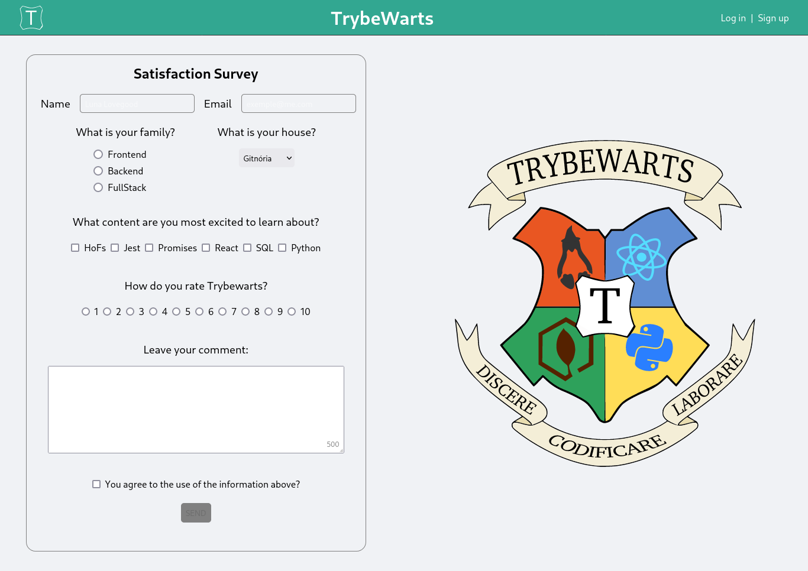

# TrybeWarts Project

[](https://opensource.org/licenses/ISC)

## Link

## [trybewarts.vercel](https://paulo-trybewarts.vercel.app/)



## About

This is my 7th project during my journey at Trybe!

In this project, I developed a feedback form page for the Trybewarts School of Magic, where students can submit their feedback about it. The theme of this project is based on J. K. Rowling's 'Harry Potter' series, as programming is the closest thing we can get to something magical!

## Repository Structure

- The `src` folder contains all the code

- The `src/assets` folder contains all the images used

## Implemented Functionalities

## Implemented User Login and Registration

<details>
  <summary>
    Implemented a user login and registration section within the <code>header</code>
  </summary> <br/>

  - When registering, the **name**, **email**, and **password** are saved in LocalStorage in the following format:
```js
[
  {
    userName: "name",
    userEmail: "email",
    userPassword: "password"
  },
  ...
]
```

  - When logging in, it checks in LocalStorage if there is a user with the email and password corresponding to those entered in the input fields. If there is, an `alert` with the text **'Login successful!'** is displayed; if not, an `alert` saying **'Invalid credentials. Please try again.'** is shown.
</details>


## Implemented a feedback form on the page

<details>
  <summary>
    Created a satisfaction form for the first semester of students at TrybeWarts school
  </summary> <br />

  - For the form to be submitted:

    - Name must be filled out with 3 or more characters
    - Email must be filled out and have the correct format (**example@test.co**)
    - A family must be chosen
    - A rating must be given to the school

  - When submitting the form, the filled and submitted data is displayed to the user
</details>

---
